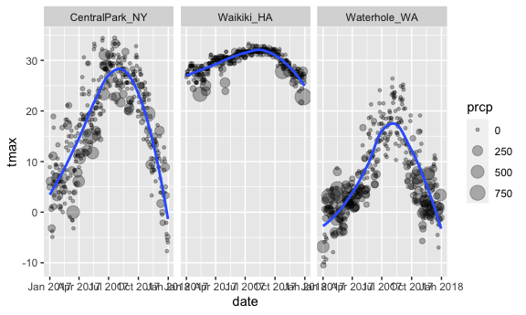
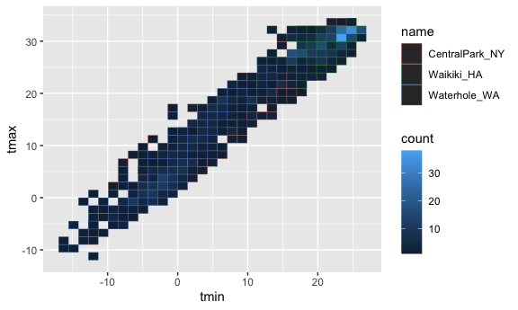

Viz EDA 1
================

## =

``` r
weather_df = 
  rnoaa::meteo_pull_monitors(
    c("USW00094728", "USC00519397", "USS0023B17S"),
    var = c("PRCP", "TMIN", "TMAX"), 
    date_min = "2017-01-01",
    date_max = "2017-12-31") %>%
  mutate(
    name = recode(
      id, 
      USW00094728 = "CentralPark_NY", 
      USC00519397 = "Waikiki_HA",
      USS0023B17S = "Waterhole_WA"),
    tmin = tmin / 10,
    tmax = tmax / 10) %>%
  select(name, id, everything())
```

    ## Registered S3 method overwritten by 'hoardr':
    ##   method           from
    ##   print.cache_info httr

    ## using cached file: ~/Library/Caches/R/noaa_ghcnd/USW00094728.dly

    ## date created (size, mb): 2021-10-05 10:29:43 (7.602)

    ## file min/max dates: 1869-01-01 / 2021-10-31

    ## using cached file: ~/Library/Caches/R/noaa_ghcnd/USC00519397.dly

    ## date created (size, mb): 2021-10-05 10:29:50 (1.697)

    ## file min/max dates: 1965-01-01 / 2020-02-29

    ## using cached file: ~/Library/Caches/R/noaa_ghcnd/USS0023B17S.dly

    ## date created (size, mb): 2021-10-05 10:29:53 (0.912)

    ## file min/max dates: 1999-09-01 / 2021-09-30

``` r
weather_df
```

    ## # A tibble: 1,095 × 6
    ##    name           id          date        prcp  tmax  tmin
    ##    <chr>          <chr>       <date>     <dbl> <dbl> <dbl>
    ##  1 CentralPark_NY USW00094728 2017-01-01     0   8.9   4.4
    ##  2 CentralPark_NY USW00094728 2017-01-02    53   5     2.8
    ##  3 CentralPark_NY USW00094728 2017-01-03   147   6.1   3.9
    ##  4 CentralPark_NY USW00094728 2017-01-04     0  11.1   1.1
    ##  5 CentralPark_NY USW00094728 2017-01-05     0   1.1  -2.7
    ##  6 CentralPark_NY USW00094728 2017-01-06    13   0.6  -3.8
    ##  7 CentralPark_NY USW00094728 2017-01-07    81  -3.2  -6.6
    ##  8 CentralPark_NY USW00094728 2017-01-08     0  -3.8  -8.8
    ##  9 CentralPark_NY USW00094728 2017-01-09     0  -4.9  -9.9
    ## 10 CentralPark_NY USW00094728 2017-01-10     0   7.8  -6  
    ## # … with 1,085 more rows

## scatterplot

``` r
weather_df %>%
  ggplot(aes(x=tmin,y=tmax)) +
  geom_point()
```

    ## Warning: Removed 15 rows containing missing values (geom_point).


``` r
ggp_tmax_tmin = 
  weather_df %>%
  ggplot(aes(x=tmin,y=tmax)) +
  geom_point()

ggp_tmax_tmin
```

    ## Warning: Removed 15 rows containing missing values (geom_point).


``` r
# ggsave
```

``` r
weather_df %>%
  ggplot(aes(x=tmin,y=tmax, color= name)) +
  geom_point(alpha=.3) +
  geom_smooth(se=FALSE)
```

    ## `geom_smooth()` using method = 'loess' and formula 'y ~ x'

    ## Warning: Removed 15 rows containing non-finite values (stat_smooth).

    ## Warning: Removed 15 rows containing missing values (geom_point).


``` r
weather_df %>%
  ggplot(aes(x=tmin,y=tmax,color=name)) +
  geom_point(alpha=.3) + # geometry specific aesthetic
  geom_smooth(se=FALSE) +
  facet_grid(. ~ name)
```

    ## `geom_smooth()` using method = 'loess' and formula 'y ~ x'

    ## Warning: Removed 15 rows containing non-finite values (stat_smooth).

    ## Warning: Removed 15 rows containing missing values (geom_point).


``` r
weather_df %>%
  ggplot(aes(x=date,y=tmax)) + 
  geom_point(aes(size = prcp),alpha=.3) +
  facet_grid(. ~ name)  + 
  geom_smooth(se=FALSE) # se TRUE will give standard error bars
```

    ## `geom_smooth()` using method = 'loess' and formula 'y ~ x'

    ## Warning: Removed 3 rows containing non-finite values (stat_smooth).

    ## Warning: Removed 3 rows containing missing values (geom_point).


\#\# use data manipulationn

``` r
weather_df %>%
  filter(name == "CentralPark_NY") %>%
  mutate(
    tmax = tmax * (9/5) + 32, # convert from C to F
    tmin = tmin * (9/5) + 32
  ) %>%
  ggplot(aes(x=tmin,y=tmax)) +
  geom_point()
```


## stack geoms

``` r
weather_df %>%
  ggplot(aes(x=date, y=tmax, color=name)) +
  geom_smooth()
```

    ## `geom_smooth()` using method = 'loess' and formula 'y ~ x'

    ## Warning: Removed 3 rows containing non-finite values (stat_smooth).


``` r
weather_df %>%
  ggplot(aes(x=tmin, y=tmax, color=name)) +
  geom_hex()
```

    ## Warning: Removed 15 rows containing non-finite values (stat_binhex).


``` r
weather_df %>%
  ggplot(aes(x=tmin, y=tmax, color=name)) +
  geom_bin_2d()
```

    ## Warning: Removed 15 rows containing non-finite values (stat_bin2d).


\#\# univariate plots

``` r
# add things to ggplot with '+'
ggplot(weather_df, aes(x = tmax, fill=name)) + 
  geom_histogram() +
  facet_grid (.  ~ name)
```

    ## `stat_bin()` using `bins = 30`. Pick better value with `binwidth`.

    ## Warning: Removed 3 rows containing non-finite values (stat_bin).


``` r
ggplot(weather_df, aes(x = tmax, fill = name)) + 
  geom_histogram(position = "dodge", binwidth = 2)
```

    ## Warning: Removed 3 rows containing non-finite values (stat_bin).


``` r
weather_df  %>%
  ggplot(aes(x = tmax, fill = name)) + 
  geom_density(alpha=.3) #  adjust = .5
```

    ## Warning: Removed 3 rows containing non-finite values (stat_density).


``` r
weather_df  %>%
  ggplot(aes(x=name,y=tmax)) +
  geom_boxplot()
```

    ## Warning: Removed 3 rows containing non-finite values (stat_boxplot).


``` r
weather_df %>%
  ggplot(aes(x=name,y=tmax)) +
  geom_violin()
```

    ## Warning: Removed 3 rows containing non-finite values (stat_ydensity).


ridges

``` r
weather_df  %>%
  ggplot(aes(x=tmax,y=name)) +
  geom_density_ridges(scale=.9,alpha=.8)
```

    ## Picking joint bandwidth of 1.84

    ## Warning: Removed 3 rows containing non-finite values (stat_density_ridges).


## embedding plots

``` r
weather_df %>%
  ggplot(aes(x=tmin,y=tmax,color=name)) +
  geom_point(alpha=.3)
```

    ## Warning: Removed 15 rows containing missing values (geom_point).


